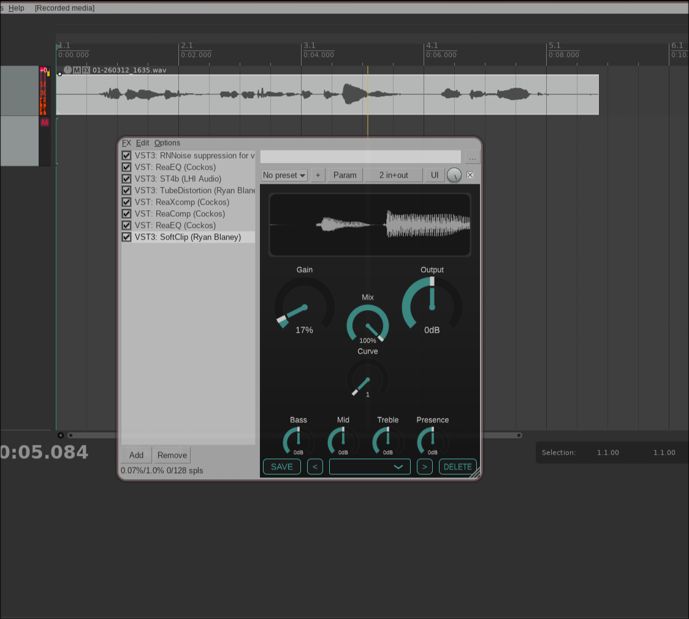

## Soft Clip

A basic .vst3/AAX/AU plugin for soft clipping. Often used in place of a limiter on
most tracks. Comes with a pre-EQ, curve (for harder clipping), and a visualizer.

## Usage

The drive knob is the soft clipper. The output knob is a hard clipper, so prefer 
keeping your output lower (less than 50%) in most cases. The curve sets an exponential 
boost to the saturator, allowing for harsher clipping. For true soft clipping, keep at 1.
